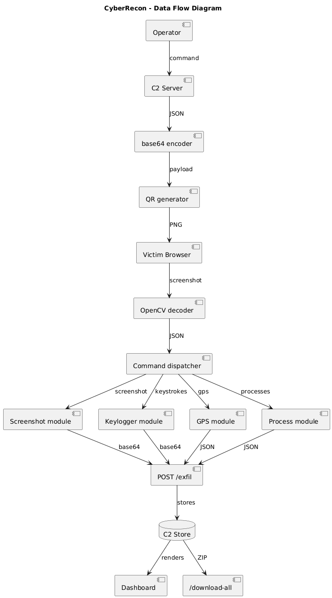
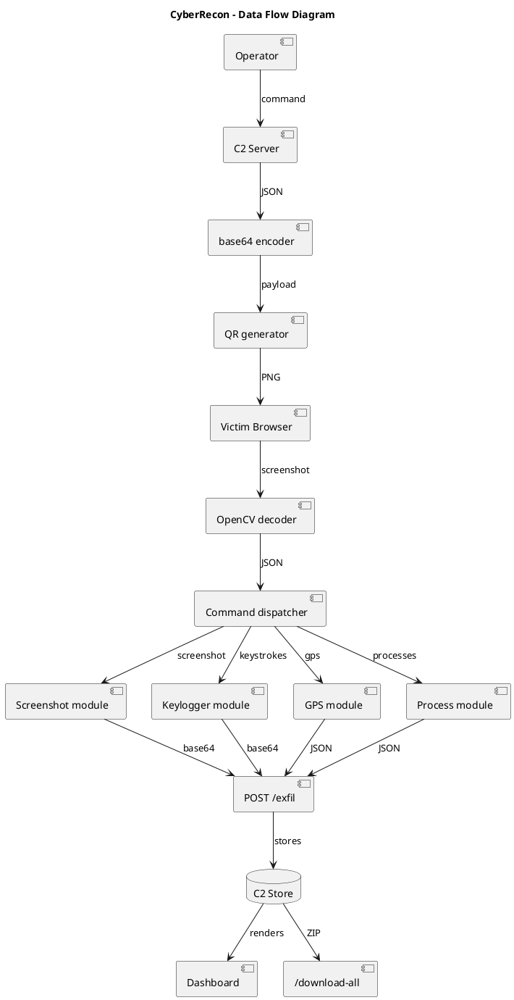

# CyberRecon — Data Flow Diagram

**Format:** PlantUML

**Source file:** [data-flow.puml](data-flow.puml)

## Rendered Diagram

## PlantUML Source

```plantuml
@startuml
skinparam packageStyle rectangle
title CyberRecon - Data Flow Diagram

[Operator] as OP
[C2 Server] as C2
[base64 encoder] as B64
[QR generator] as QR
[Victim Browser] as VICTIM
[OpenCV decoder] as CV
[Command dispatcher] as DISP

[Screenshot module] as SS
[Keylogger module] as KL
[GPS module] as GPS
[Process module] as PR

[POST /exfil] as EXFIL
database "C2 Store" as STORE
[Dashboard] as DASH
[/download-all] as DL

OP --> C2 : command
C2 --> B64 : JSON
B64 --> QR : payload
QR --> VICTIM : PNG
VICTIM --> CV : screenshot
CV --> DISP : JSON

DISP --> SS : screenshot
DISP --> KL : keystrokes
DISP --> GPS : gps
DISP --> PR : processes

SS --> EXFIL : base64
KL --> EXFIL : base64
GPS --> EXFIL : JSON
PR --> EXFIL : JSON

EXFIL --> STORE : stores
STORE --> DASH : renders
STORE --> DL : ZIP

@enduml
```